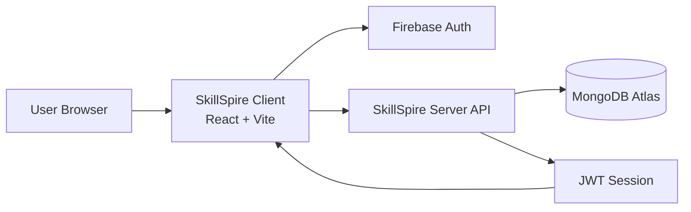

# SkillSpire Client


Production frontend for the SkillSpire contest platform.

This project is built with React and Vite, uses Firebase Authentication, and connects to the SkillSpire API for role-based contest workflows.

## Live URL

- Production: https://skillspire-client-2-0.vercel.app

## Tech Stack

- React 18 + Vite
- React Router
- Tailwind CSS + DaisyUI
- Axios
- Firebase Authentication
- Framer Motion + AOS
- SweetAlert2

## Core Features

- Public contest discovery and details
- Role-based dashboard (User, Creator, Admin)
- JWT-backed authenticated API access
- Contest creation, moderation, and submission flows
- Leaderboard and winners pages
- Responsive UI for mobile, tablet, and desktop

## Project Structure

```text
src/
	api/
	assets/
	components/
	context/
	firebase/
	hooks/
	layout/
	pages/
	routes/
```

## Architecture Diagram



## Environment Variables

Create `.env` in the client root:

```env
VITE_apiKey=your_firebase_api_key
VITE_authDomain=your_firebase_auth_domain
VITE_projectId=your_firebase_project_id
VITE_storageBucket=your_firebase_storage_bucket
VITE_messagingSenderId=your_firebase_sender_id
VITE_appId=your_firebase_app_id
VITE_imgHost=your_imgbb_api_key
VITE_API_BASE_URL=https://skillspire-server-2-0.vercel.app
```

## Local Development

Install dependencies:

```bash
npm install
```

Start dev server:

```bash
npm run dev
```

Build for production:

```bash
npm run build
```

Preview production build locally:

```bash
npm run preview
```

## Deployment (Vercel)

- Framework preset: Vite (auto-detected)
- Build command: `npm run build`
- Output directory: `dist`
- Required Vercel environment variables: all `VITE_*` keys listed above

After deployment, ensure Firebase Authentication Authorized Domains includes:

- `skillspire-client-2-0.vercel.app`

## API Dependency

This client is configured to use:

- https://skillspire-server-2-0.vercel.app

If you change backend URL, update `VITE_API_BASE_URL` and redeploy.
